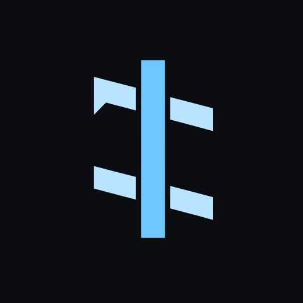
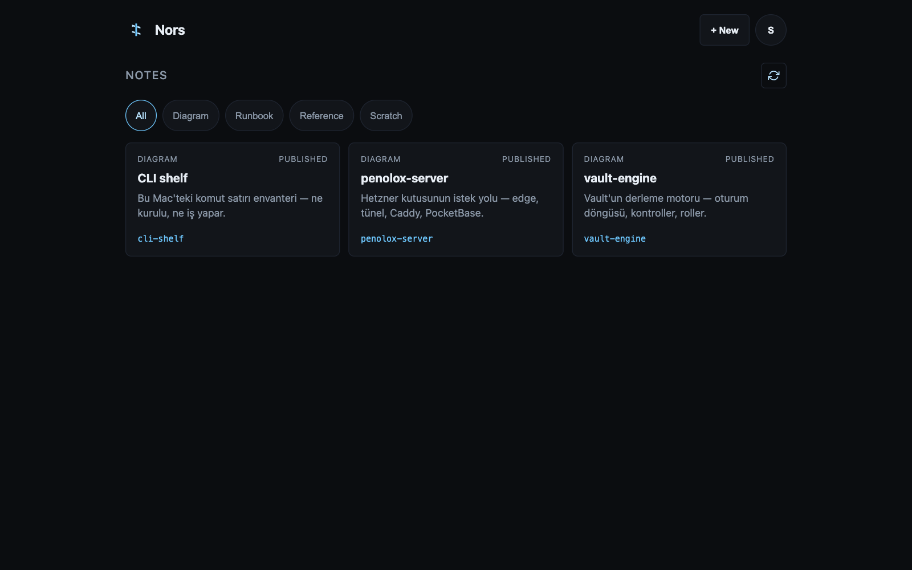
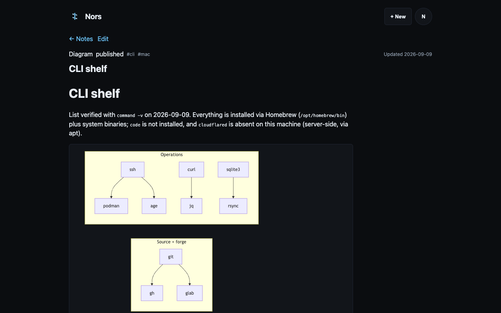

<div align="center">



# Nors

**Personal ops notes that ride a PocketBase instance you already run.**

[](LICENSE)
[](https://www.npmjs.com/package/@burakboduroglu/nors)


</div>

---

Nors is not an application you deploy. It is one migration and one static
page, copied into a PocketBase directory you already have. The database,
auth, HTTP server and backups are already running — a dedicated notes app
would duplicate all of them.

<div align="center">



</div>

## What it is

Notes live as cards on a dashboard, filed under four kinds: Diagram, Runbook,
Reference, Scratch. An agent drafts in markdown, you publish from the panel —
paste a blob, fix the title, pick a kind, done. Bodies render as markdown and
Mermaid fences become diagrams in the reader.

Writing stays minimal on purpose: title, kind, pinned, body. The slug grows
out of the title and the summary out of the first clean body line, so there
is nothing else to fill in.

## Highlights

|     | Feature | How it works |
| --- | ------- | ------------ |
| 🧩 | **No infrastructure of its own** | Files copied into an existing PocketBase. No container, no second database, no extra port. |
| 📝 | **Write four things, nothing else** | Title, kind, pinned, body. Slug and summary derive themselves. |
| 📊 | **Diagrams without a plugin** | Mermaid loads only on pages that hold a fence; everything else never downloads it. |
| ↔️ | **Order by dragging** | Native HTML5 drag-and-drop renumbers `sort`; pinned cards stay first by construction. No DnD library. |
| 📥 | **Seeds are upserts** | `bun run import-seeds` matches by slug — re-running updates instead of duplicating. |
| 🛡️ | **Unsaved work asks first** | Leaving the editor with edits pops a guard instead of silently dropping the draft. |
| 📵 | **No telemetry** | Zero outbound requests. The page talks to your PocketBase and nothing else. |

<div align="center">



</div>

## Footprint

Measured with `du`:

| | |
| --- | --- |
| Installed files | **3.5 MB** — migration 4 KB, page the rest |
| First visit | **~87 KB** — entry JS ~79 KB (gzip ~24 KB), CSS ~7.5 KB |
| The other 3.4 MB | Mermaid diagram chunks, fetched only when a reader page holds a fence |
| Database growth | one `nors_notes` row per note, inside the existing `pb_data` |
| Extra processes | none |
| Extra ports | none |

If PocketBase is already running, the marginal cost of Nors is the file sizes.

## Install

Install into a PocketBase directory with the packaged CLI:

```bash
bunx @burakboduroglu/nors install /path/to/pocketbase
```

This copies the migration and built page; it never touches `pb_data`. Then
restart PocketBase so the migration runs. **If it was already running, stop it
before copying and start it afterwards** — PocketBase watches its directories
and can race a service manager doing the same.

For a source checkout and remote host, the `deploy/` installer performs the
stop → copy → start sequence:

```bash
scp -r pb_migrations pb_hooks pb_public deploy/install.sh host:/tmp/nors-stage/
ssh host
sudo /tmp/nors-stage/install.sh /tmp/nors-stage
```

The page is served at `/nors/`. Gate `/nors` and
`/api/collections/nors_notes` in Cloudflare Access the way `/subs/` is gated
(see `deploy/access-caddy.md`). Then load the three seed notes through the API:

```bash
NORS_PB_URL=https://your.host NORS_PB_EMAIL=... NORS_PB_PASSWORD=... \
  bun run import-seeds
```

## How it works

```
browser ──▶ /nors/                            static page, superuser login
browser ──▶ /api/collections/nors_notes/*      superuser only, CRUD + reorder
Glance  ──▶ 127.0.0.1:8090/api/nors/summary    counts + recent titles
agent   ──▶ drafts markdown ──▶ editor ──▶ publish
```

Routes are hashes: `#/` dashboard, `#/n/<slug>` reader,
`#/edit/<slug|$new>` editor. `/nors/?new=1` is the stable external entry point
for a new note; it consumes the query and opens the `$new` editor route.

## Security

The `nors_notes` collection has null API rules, which in PocketBase means
superuser only. The dashboard holds a superuser token in localStorage — anyone
with the browser profile has the keys, documented rather than hidden. There is
no audit log and no second user; this is a single-operator surface behind
Cloudflare Access, not a multi-user app.

The Glance summary hook has no PocketBase authentication because Glance reads
it over loopback. The public reverse proxy must return `404` for the exact
`/api/nors/summary` path; `deploy/patch-caddy-nors-summary.py` installs that
guard. Do not expose this endpoint publicly: it includes recent note titles.

## What it deliberately does not do

No in-app LLM calls. No public notes or team sharing. No wiki search, tag
graph, or version history UI. No reminders. It does not replace a vault or a
knowledge base — it is the live dashboard above them.

## Stack

PocketBase for storage, auth and HTTP. SolidJS + Vite UI compiled to static
files under `pb_public/nors/`. `marked` for markdown, Mermaid on demand, no
CSS library, no UI server. Bun as the package manager.

## Develop the UI

Source lives in `web/`. The shipped page is built output:

```bash
bun --cwd web install
bun run build      # root script — emits pb_public/nors/
bun run dev        # local UI; /api proxied to :8090 (NORS_PB_PORT to move it)
```

Against a tunneled production box: `ssh -N -L 8090:127.0.0.1:8090 host`,
then `bun run dev` — the browser stays on localhost, so neither CORS nor
Cloudflare Access is in the path.

## License

MIT — see [LICENSE](LICENSE).
