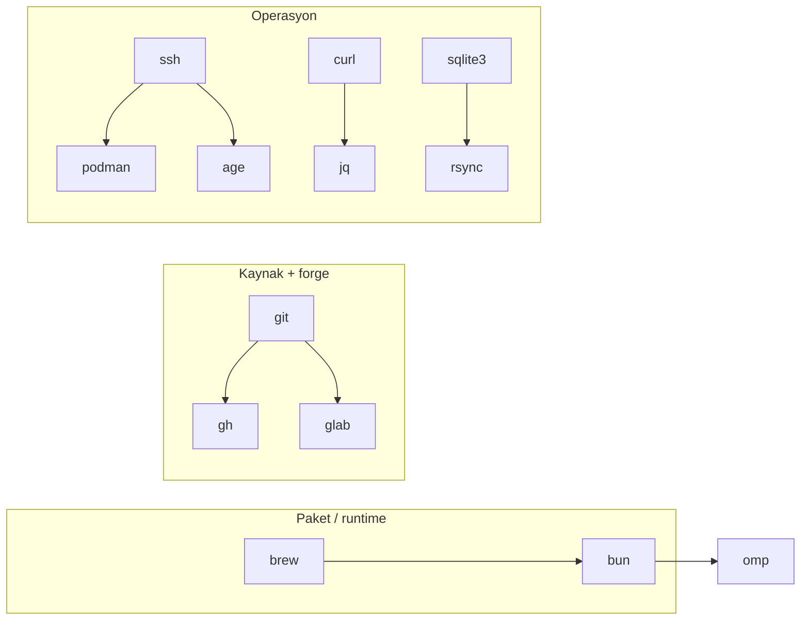

# CLI shelf

2026-09-09'da `command -v` ile doğrulanan liste. Kurulumların tamamı
Homebrew (`/opt/homebrew/bin`) + sistem ikilileri; `code` kurulu değil,
`cloudflared` bu makinede yok (sunucu tarafında, apt ile).

| CLI | Ne yapar | Tipik kullanım |
|---|---|---|
| `brew` | Paket yöneticisi | Her şeyin kurulumu |
| `bun` | JS runtime + paket yöneticisi | nors/skadi `bun run build`, scriptler |
| `podman` | Container + VM | `hezarfen_backend` buildleri (makine 4 CPU / 6 GiB) |
| `gh` | GitHub | Klon, release, repo açıklama/topic bakımı |
| `glab` | GitLab CLI | Kurulu ama pasif — repo'lar GitHub'da |
| `git` | VCS | Hepsi |
| `jq` | JSON | API cevaplarını ayıklama |
| `curl` | HTTP | PB `/api/health` yoklamaları, dosya indirme |
| `sqlite3` | SQLite | `pb_data` incelemesi — her zaman **yerel kopyada** |
| `rsync` | Dosya taşıma | Sunucuya dosya gönderme (`scp` ile birlikte) |
| `age` | Şifreleme | `restore-kit` yedekleri |
| `vim` / `nvim` | Terminal editör | Hızlı düzeltmeler |
| `omp` | Agent harness CLI | Bu oturumların koştuğu zemin |
| `ssh hetzner` | Sunucu erişimi | Alias → `178.105.131.189:2222`, kullanıcı `burak`, key ile |

Sunucu tarafının kendi seti (`pocketbase`, `caddy`, `cloudflared`) ayrı —
ayrıntı `penolox-server` notunda.
