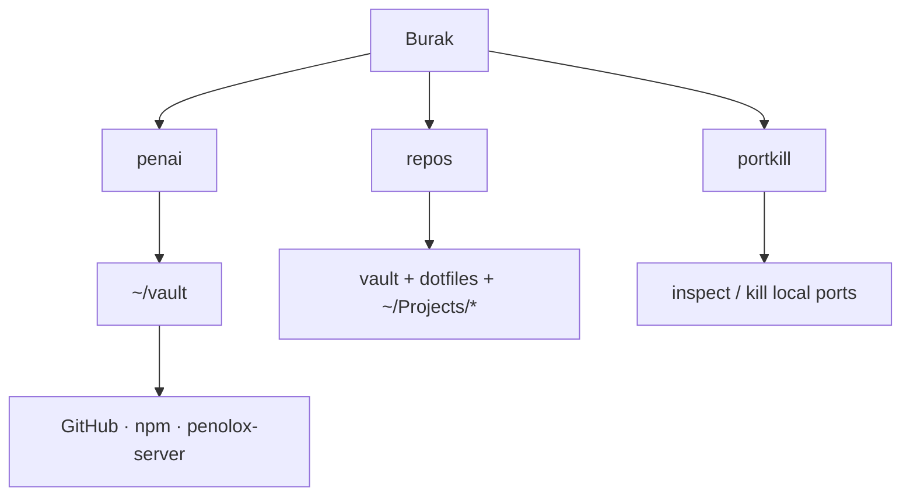

# My command shelf

This is the command surface I actually use — personal tools first, dependencies
second. Verified on **2026-09-10**. “Published” does not automatically mean
“installed on this Mac”.

## Built here and in use

| Command | Location | What it does |
|---|---|---|
| `portkill` **0.4.6** | `/opt/homebrew/bin/portkill` | My macOS/Linux port inspector and killer; ranges, dry-run, list and loopback GUI. Installed through my Homebrew tap. |
| `repos` | `~/.local/bin/repos` → `~/dotfiles/bin/repos` | Scans vault, dotfiles and every Git repo directly under `~/Projects`; shows dirty/staged/untracked/stash plus ahead/behind state. `repos check` is quiet when everything is clean. |
| `penai` | zsh function | Opens `~/vault` in Claude: the entry point to PenAI and the context layer. |
| `invest` | zsh function | Opens `~/Projects/investment` in its project-scoped Claude session. |
| `penolox-drill.sh` | `~/bin/penolox-drill.sh` | Pulls the newest encrypted restore kit from R2, decrypts it locally and runs SQLite integrity checks. |

## Shell operations I own

| Command | Job | Important behaviour |
|---|---|---|
| `dpi-on` / `dpi-off` / `dpi-status` | Controls SpoofDPI and the macOS system proxy | Proxy is enabled only after the local port answers; shell startup clears a dead proxy automatically. |
| `dpi-chrome` | Opens a separate proxied Chrome profile | Leaves the main browser profile alone. |
| `proxy-panic` | Emergency proxy reset | Turns both Wi-Fi web proxies off when networking is stuck. |
| `sshkeys` / `sshpub <name>` | Audits and copies public SSH keys | Prints fingerprints; never exposes private keys. |
| `ssh hetzner` | Interactive server entry | Uses Mosh for the single-host interactive form; port forwards and remote commands still use real SSH. |

## My published command products

| Product | Latest | Installed here? | Role |
|---|---:|---|---|
| `portkill` | **0.4.6** | yes | Port process CLI. |
| `penote` | **3.0.1** | no | Zero-dependency programming-notes CLI and Web UI. |
| `skadi` | **0.1.4** | no | Installer CLI for the PocketBase subscription tracker. Source and npm are current; the server still runs the pre-Skadi `/subs/` app. |
| `nors` | **0.1.3** | no | Installer CLI for Nors. Source and npm are current. |

MacShelf **0.2.0** belongs to the same product shelf but is a native menu-bar
app, not a CLI. It is installed at `/Applications/MacShelf.app`.

## Supporting tools

| Area | Commands |
|---|---|
| Agent work | `claude`, `grok` |
| Research/browser | `bx`, `firecrawl`, `agent-browser` |
| Git forges | `git`, `gh`, `glab` |
| Runtime/build | `bun`, `uv`, `go`, `podman`, `podman-compose` |
| Ops/data | `ssh`, `mosh`, `curl`, `jq`, `age`, `rclone`, `sqlite3`, `rsync` |
| Platforms | `supabase`, `wrangler` |

Package rule: **Bun for JavaScript, Homebrew for macOS packages.**
