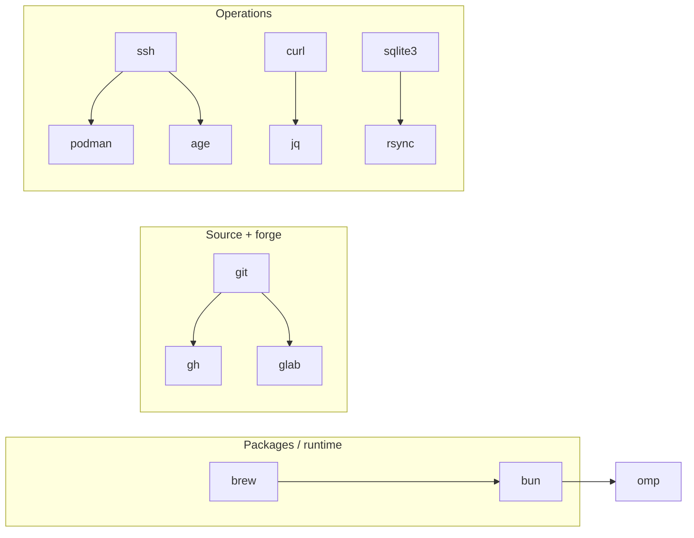

# CLI shelf

List verified with `command -v` on 2026-09-09. Everything is installed via
Homebrew (`/opt/homebrew/bin`) plus system binaries; `code` is not installed,
and `cloudflared` is absent on this machine (server-side, via apt).

| CLI | What it does | Typical use |
|---|---|---|
| `brew` | Package manager | Installing everything |
| `bun` | JS runtime + package manager | nors/skadi `bun run build`, scripts |
| `podman` | Containers + VMs | `hezarfen_backend` builds (machine: 4 CPUs / 6 GiB) |
| `gh` | GitHub | Clone, release, repo description/topic maintenance |
| `glab` | GitLab CLI | Installed but idle — repos live on GitHub |
| `git` | VCS | Everything |
| `jq` | JSON | Filtering API responses |
| `curl` | HTTP | PB `/api/health` probes, file downloads |
| `sqlite3` | SQLite | `pb_data` inspection — always **on a local copy** |
| `rsync` | File transfer | Sending files to the server (together with `scp`) |
| `age` | Encryption | `restore-kit` backups |
| `vim` / `nvim` | Terminal editors | Quick fixes |
| `omp` | Agent harness CLI | The ground these sessions run on |
| `ssh hetzner` | Server access | Alias → `178.105.131.189:2222`, user `burak`, key-based |

The server side has its own set (`pocketbase`, `caddy`, `cloudflared`) —
details in the `penolox-server` note.
