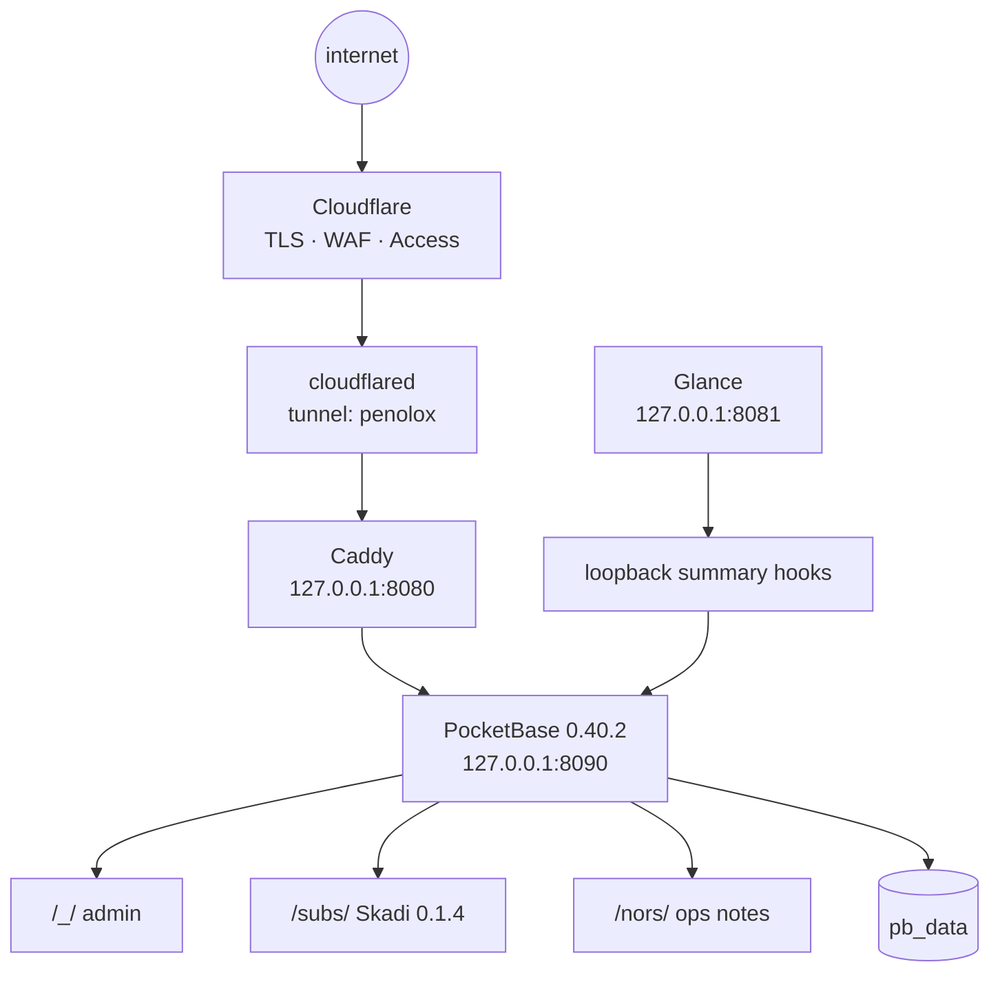

# penolox-server — live map

Hetzner KVM running Debian 13: **2 vCPU, 3.7 GiB RAM, 38 GiB disk and
2 GiB swap**. Checked on **2026-09-10**. No Docker and no PaaS; the shared
PocketBase process is the application platform.



## What is actually live

| Surface | State |
|---|---|
| PocketBase admin `/_/` | Live behind Cloudflare Access. |
| Nors `/nors/` | Live behind Access with three published notes. Source, npm and the deployed frontend are current at **0.1.3**. |
| Skadi `/subs/` | **0.1.4** is live. Its HTML, JavaScript and CSS match the clean release checkout byte for byte. |
| Skadi source/npm | GitHub tag and npm `latest` are **0.1.4**. |
| Glance | Separate systemd service; Apps contains subscription and Nors summaries plus the Nors bookmark. |

## Request path and boundaries

- Cloudflare owns public TLS, WAF and Access. The tunnel carries the original
  hostname to Caddy.
- Caddy must use the real hostname and `bind 127.0.0.1`; a loopback site label
  does not match tunneled traffic, while omitting `bind` exposes port 8080.
- PocketBase data lives in `/opt/pocketbase/pb_data` under the `pocketbase`
  system user. Collections are superuser-only.
- The Nors and subscription summary endpoints are for Glance over loopback;
  exact public routes are blocked at Caddy.

## Access

```text
ssh hetzner
└─ SSH config alias · non-default port · user burak · key-only
```

Interactive `ssh hetzner` uses Mosh from the Mac. `burak` has sudo, but sudo
requires a password. Agents inspect remotely; Burak performs server writes.

## Deploy rules

1. Build on the Mac; do not build on this small server.
2. Stage and copy the exact build, migration and hook files.
3. For PocketBase changes use **stop → copy → start**. Updating hooks and then
   calling `restart` can hang for the full 90-second stop timeout.
4. Verify the running service, loopback HTTP response and public Access route;
   configuration text alone is not proof.

## Recovery

- `restore-kit.timer` creates an age-encrypted PocketBase restore kit at
  03:30 UTC.
- The kit is copied off the box to R2; `~/bin/penolox-drill.sh` on the Mac
  downloads the newest kit, decrypts it and runs SQLite integrity checks.
- `unattended-upgrades` is security-only, with reboot at 04:00 when required.

The box is intentionally simple: one tunnel, one web front, one PocketBase,
one Glance process, and recoverable data.
