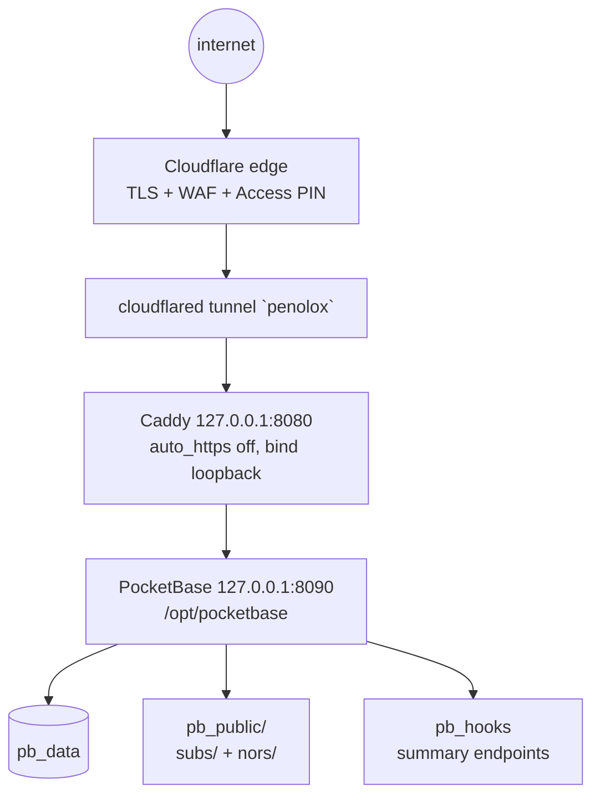

# penolox-server

Hetzner KVM, Debian 13, 2 vCPU, 3.7 GiB RAM. First real workload:
Caddy + PocketBase behind a Cloudflare Tunnel. No Docker, no PaaS.
(Facts from the 2026-09-08 inventory; versions go stale over time.)

## Parts

- **PocketBase** (v0.40.2) — `/opt/pocketbase/pocketbase` (root),
  data at `/opt/pocketbase/pb_data` (`pocketbase` user).
  systemd unit `pocketbase.service`, `ProtectSystem=strict`.
- **Caddy** — the box's web front; reverse proxy to PB, `redir / /_/`.
  The site address must be the real hostname (the tunnel carries the
  original `Host`). Without `bind 127.0.0.1` it listens on `*:8080` —
  left exposed.
- **cloudflared** — service under `/etc/cloudflared/`;
  `cloudflared-update.timer` updates itself every night at 00:00.
- **Cloudflare Access** — `/_/` and app paths closed behind a one-time
  PIN (burakboduroglu0@gmail.com). For Nors, `/nors` +
  `/api/collections/nors_notes` targets are required.
- **Collections** — `subscriptions` + `fx_rates` (Skadi),
  `nors_notes` (this panel). All three superuser-only.

## Scheduled jobs

- `restore-kit.timer` 03:30 UTC — age-encrypted backup to
  `/var/backups/penolox`; the Mac pulls it to iCloud at 07:30.
  New rows land in the same `pb_data`, no extra target.
- `unattended-upgrades` — security only, reboots at 04:00 if needed.

## Access and deploy rules

- SSH: `ssh hetzner` → `178.105.131.189:2222`, `burak`, key.
  `sudo` asks for a password — the agent can look, not manage.
- PB deploy order is **stop → copy → start**; `restart` over
  hooks/migrations hangs for 90 seconds (until SIGKILL, the old
  process keeps serving).
- Edge rate limit: `/api/collections/_superusers*` 5 requests per
  10 seconds. Paste when attempting login, don't force it.
