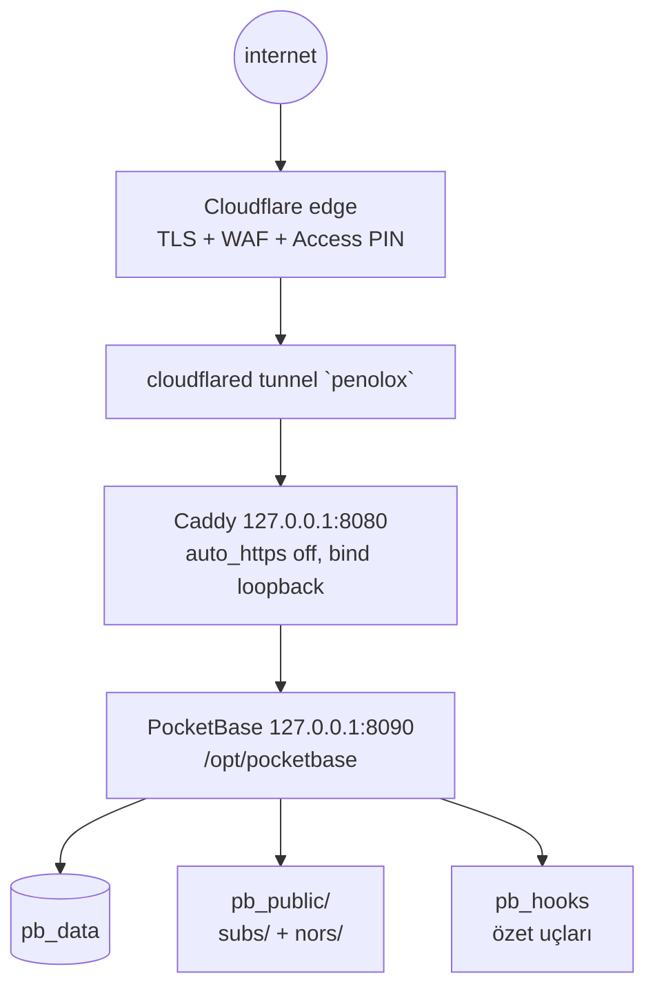

# penolox-server

Hetzner KVM, Debian 13, 2 vCPU, 3.7 GiB RAM. İlk gerçek iş yükü:
Cloudflare Tunnel arkasında Caddy + PocketBase. Docker yok, PaaS yok.
(Bilgiler 2026-09-08 tarihli envanterden; sürümler zamanla eskir.)

## Parçalar

- **PocketBase** (v0.40.2) — `/opt/pocketbase/pocketbase` (root),
  veri `/opt/pocketbase/pb_data` (`pocketbase` kullanıcısı).
  systemd birimi `pocketbase.service`, `ProtectSystem=strict`.
- **Caddy** — kutunun web önü; PB'ye reverse proxy, `redir / /_/`.
  Site adresi gerçek hostname olmalı (tünel orijinal `Host`'u taşır).
  `bind 127.0.0.1` olmadan `*:8080` dinler — halka açık kalır.
- **cloudflared** — `/etc/cloudflared/` altında servis;
  `cloudflared-update.timer` her gece 00:00'da kendini günceller.
- **Cloudflare Access** — `/_/` ve uygulama yolları tek-seferlik PIN ile
  kapalı (burakboduroglu0@gmail.com). Nors için `/nors` +
  `/api/collections/nors_notes` hedefleri gerekir.
- **Collection'lar** — `subscriptions` + `fx_rates` (Skadi),
  `nors_notes` (bu panel). Üçü de superuser-only.

## Zamanlanmış işler

- `restore-kit.timer` 03:30 UTC — age-şifreli yedek `/var/backups/penolox`;
  Mac 07:30'da iCloud'a çeker. Yeni satırlar aynı `pb_data`'da, ek hedef yok.
- `unattended-upgrades` — sadece güvenlik, 04:00'ta gerekiyorsa reboot.

## Erişim ve deploy kuralları

- SSH: `ssh hetzner` → `178.105.131.189:2222`, `burak`, key.
  `sudo` parola ister — agent bakabilir, yönetemez.
- PB deploy sırası **stop → kopyala → start**; hook/migration üstüne
  `restart` 90 saniye takılır (SIGKILL'e kadar eski süreç servis verir).
- Edge rate limit: `/api/collections/_superusers*` 10 saniyede 5 istek.
  Login denerken yapıştır, zorlama.
