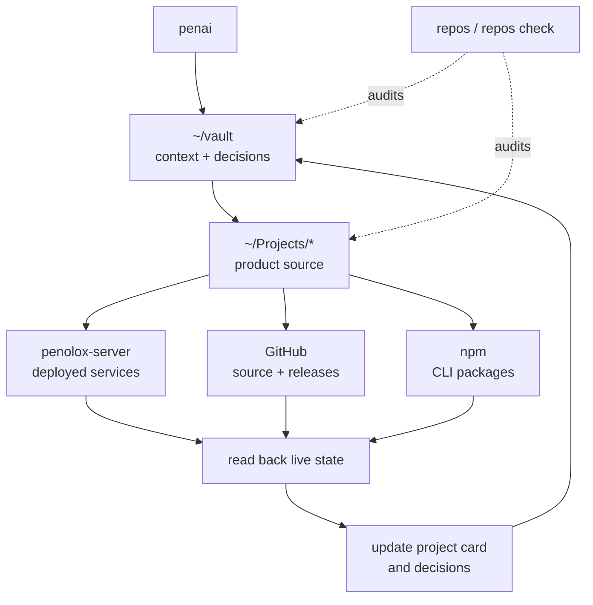

# PenAI workspace map

`penai` is the shell door into `~/vault`; `repos` is the machine-wide truth
check. Together they connect memory, source repositories and what is actually
shipped.



## The three machine layers

| Layer | Location | Authority |
|---|---|---|
| Context | `~/vault` | Decisions, identity, project state and durable operational knowledge. |
| Configuration | `~/dotfiles` and `~/.claude` | Shell commands, agent configuration, hooks and skills. |
| Product source | `~/Projects/*` | Code, tests, builds, release metadata and deployment files. |

`repos` discovers all three automatically. Its marks are `+` staged, `*`
unstaged, `?` untracked and `$` stash; sync state reports clean, ahead, behind
or diverged. `repos check` exits silently only when every tracked repository is
clean and synchronized.

## Session loop

1. `penai` enters the vault and starts Claude with the context layer.
2. Session-start injects the resume bridge, open threads, rules map and compact
   knowledge titles.
3. Work happens in the relevant project repository.
4. Tests prove the source; GitHub/npm/server reads prove what shipped.
5. The vault records the resulting state and `vault-check.py` validates it.
6. The closing ritual writes where to resume; the machine log is a fallback,
   not the memory system itself.

## Useful checks

```bash
repos                 # every repo: branch, marks and remote sync
repos check           # quiet only when the machine's repos are healthy

cd ~/vault && python3 scripts/vault-check.py    # notes sound? (~0.1s)
cd ~/vault && bash scripts/verify-engine.sh     # engine sound? (~13s)
cd ~/vault && bash scripts/system-check.sh      # machine sound?
```

The core rule is simple: an API call, push or deploy command is not success.
Read the resulting state back, then update the record that future PenAI
sessions will trust.
