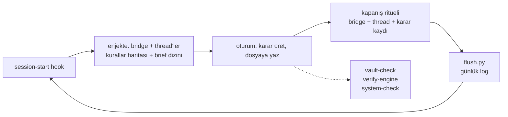

# vault-engine

Vault (`~/vault`) üç katmanlı hafızanın **bağlam katmanıdır**: ham veri değil,
karar durur. Johnny Decimal dizinleri; her dizinin `README`'si neyin nereye
ait olduğunu söyler. Ajan içeride **PenAI** adıyla çalışır.



## İlkeler (kısa)

- **Evidence over claims** — API çağrısı başarı değildir; geri okuyup
  kanıtlamak başarıdır.
- **Blank beats wrong** — boş `<TODO>` bilgidir, uydurma satır hasardır.
- **Geri alınabilir iş özerk, geri alınamaz iş sorar.** Belirsiz olan
  ikinci sayılır.
- **Yapılmayan söylenir.** Yarım işi bitmiş gibi raporlamak, bitmemiş
  bırakmaktan pahalıdır.

## Makineye ait dosyalar (el değmez)

- `050-Daily/` ve `550-Compiled/` — hook üretir, insan ellemez;
  `500-Knowledge/` üzerinde otorite değildir.
- `550-Compiled/brief.md` her oturuma enjekte edilir: başlıklar iddia
  cümlesidir, özet `index.md`'dedir ve asla enjekte edilmez.
- `850-Companion/` — bridge (nerede kaldık), thread'ler (tek oturumu
  aşan işler), kurallar. Kapanan thread silinir, arşivlenmez — git tutar.

## Kontroller

```bash
cd ~/vault && python3 scripts/vault-check.py    # notlar sağlam mı (~0.1s)
cd ~/vault && bash scripts/verify-engine.sh     # motor sağlam mı (~13s)
cd ~/vault && bash scripts/system-check.sh      # makine sağlam mı
```

Üçü de temizken sessizdir; ses çıkarıyorsa bulgu vardır.
`vault-check.py` çıkışı 2 ise denetçi çökmüştür — temizlik değil, bug'dır.
