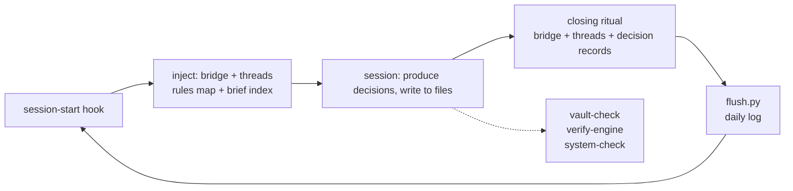

# vault-engine

The vault (`~/vault`) is the **context layer** of a three-layer memory:
it holds decisions, not raw data. Johnny Decimal directories; each
directory's `README` says what belongs where. Inside, the agent runs
under the name **PenAI**.



## Principles (short)

- **Evidence over claims** — an API call is not success; reading back
  and proving it is.
- **Blank beats wrong** — an empty `<TODO>` is information, a fabricated
  line is damage.
- **Reversible work is autonomous, irreversible work asks.** Anything
  ambiguous counts as the second.
- **Say what you did not do.** Reporting half-done work as finished
  costs more than leaving it unfinished.

## Machine-owned files (hands off)

- `050-Daily/` and `550-Compiled/` — generated by hooks, never
  hand-edited; not authoritative over `500-Knowledge/`.
- `550-Compiled/brief.md` is injected into every session: headings are
  claim sentences, the summary lives in `index.md` and is never injected.
- `850-Companion/` — bridge (where we left off), threads (work spanning
  more than one session), rules. A closed thread is deleted, not
  archived — git keeps it.

## Checks

```bash
cd ~/vault && python3 scripts/vault-check.py    # notes sound? (~0.1s)
cd ~/vault && bash scripts/verify-engine.sh     # engine sound? (~13s)
cd ~/vault && bash scripts/system-check.sh      # machine sound?
```

All three are silent when clean; output means findings.
If `vault-check.py` exits 2, the checker itself crashed — not
cleanliness, a bug.
